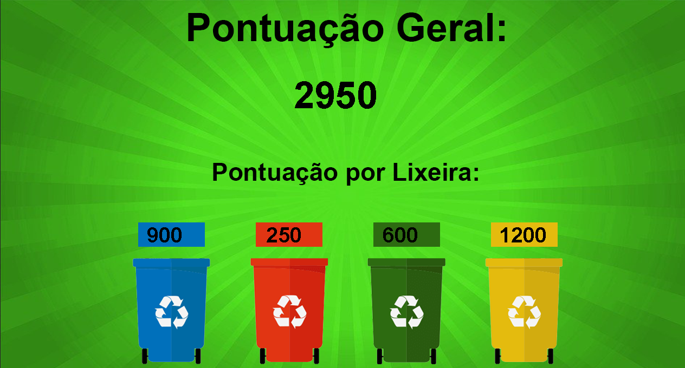

# Jogo Reciclagem
#####  Trabalho realizado em grupo para faculdade

## Objetivo
Esse projeto foi realizado com o objetivo de colocar em prática as técnicas de POO com Java, criando um jogo educacional referente a forma correta de reciclagem.

## Projeto
 A organização do programa recebeu modificações e adaptações diversas vezes para comportar e se adequar ao que nos queríamos.
O que sucedeu primeiramente, foram algumas ideias do que poderia ver a ser o nosso projeto, a primeira a ideia a ser tratada foi sobre um jogo em forma de diálogos e perguntas de múltiplas escolhas, baseado em tipos de lixos recicláveis e suas respectivas lixeiras de descarte, porém essa ideia foi deixada de lado por esse tipo de jogo não condizer com a ideia de praticidade e aprendizado enquanto se diverte.
A nossa próxima tentativa foi um jogo baseado na mesma ideia da primeira tentativa, mas sem os diálogos. No caso, o usuário lê as instruções para saber quais são os lixos e suas respectivas lixeiras correta de descarte, depois inicia um jogo onde ele pode movimentar uma lixeira para coletar os resíduos corretos, dessa forma iniciamos o desenvolvimento do jogo.

## O Jogo

A ideia do desenvolvimento é bem simples, mas com uma característica importante na educação, informações importantes para sapiência ambiental. As regras se baseiam nos conceitos recicláveis, elementos que são: papel, vidro, plástico, alumínio e objetos não recicláveis. Esses componentes são a base do nosso jogo que tem uma ligação referente ao regulamento do sistema lixeira.

A lixeira altera com o tempo (30 segundos cada). As regras são bem claras, cada item reciclável que o jogador acertar na lixeira certa ele recebe 100 pontos, quando o jogador pegar um lixo que não seja adequado a lixeira que estiver ativa no momento ou o lixo não for reciclável ele perde 50 pontos. Os pontos são visíveis durante todo o jogo e no final irá aparecer uma tela com a pontuação geral e a pontuação por lixeira.

##### [Download do jogo executavel](https://drive.google.com/file/d/1xqQEb_p10zYgFR5e3jOPXpSd6SABQ83F/view?usp=sharing)

# Criadores
 - [Josiel Junior](https://github.com/josieljunior)
 - [Guilherme Henrique](https://github.com/GuilleOne)
 - [Jhonatha Daniel](https://github.com/jhonathadaniel)

## [License](./LICENSE)
